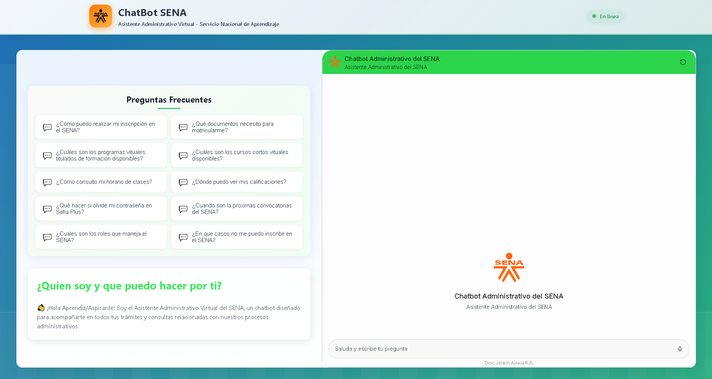
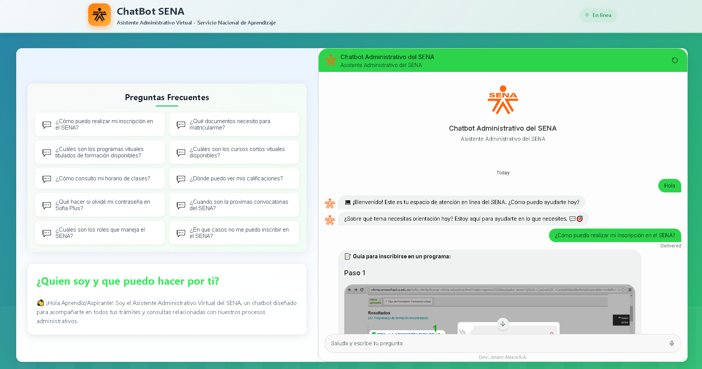
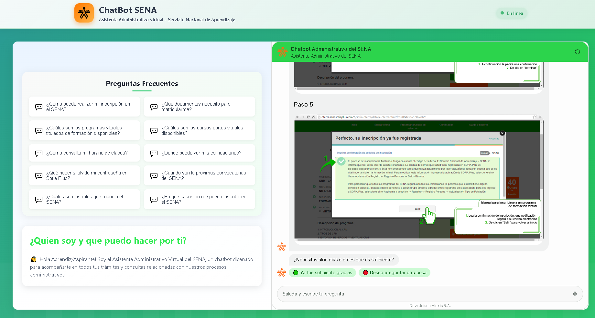
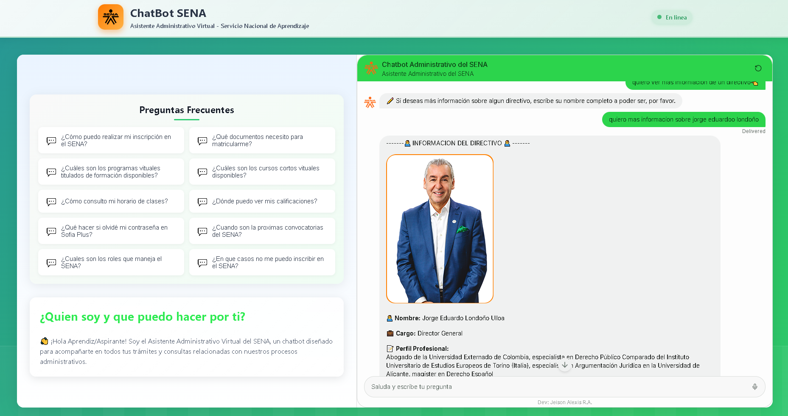

# 🤖 Chatbot Administrativo Virtual SENA — Frontend Web 💬

Interfaz web desarrollada en **React + Vite** para la interacción directa con un **Chatbot Asistente Administrativo Virtual del SENA**, conectado a **Botpress Cloud** mediante un widget embebido en tiempo real.

El sistema permite a los usuarios consultar información académica, administrativa e institucional del SENA a través de una experiencia conversacional moderna e intuitiva.

Proyecto desarrollado como parte de la formación **Tecnologo ADSO — Análisis y Desarrollo de Software del SENA**.

---

## 🧠 Funcionalidades Principales

- 💬 Integración directa con Botpress Cloud
- ⚛️ Frontend moderno con React + Vite
- 🎨 Diseño moduralizado
- 🤖 Interaccion fluida y directa
- 🌍 Interfaz intuitiva
- 🔗 Comunicación con backend scraping API a través de Botpress
- ⚡ Carga rápida gracias a Vite
- 🧩 Componentes reutilizables

---

## 🛠️ Tecnologías Utilizadas

- React
- Vite
- JavaScript (ES6+)
- CSS3
- Botpress Webchat
- HTML5

---

## 📊 Arquitectura General

Usuario  
⬇  
Frontend React + Vite  
⬇  
Botpress Cloud  
⬇  
Backend Scraping API  
⬇  
Páginas Oficiales SENA  

---


## 🖥️ Diseño de la Interfaz

El sistema cuenta con dos secciones principales:

### 🧍 Sección Izquierda

- Información visual del asistente
- Diseño institucional SENA
- Preguntas frecuentes de acceso rapido

### 💬 Sección Derecha

- Chat en tiempo real con Botpress
- Webchat embebido
- Estilos personalizados
- Iframe expandido al 100%

---

## 📷 Capturas 📷

- Home
<div align="center">
  
</div>

- Pregunta frecuente de acceso rapido
<div align="center">
  
  
</div>

- Visual de la multimedia a traves de la interfaz
<div align="center">
  
</div>

---

## 🚀 Instalación y Uso

### 1️⃣ Clonar repositorio

```bash
git clone URL_DEL_REPOSITORIO
cd frontend-chatbot-sena
```

### 2️⃣ Instalar dependencias

```bash
npm install
```

### 3️⃣ Ejecutar entorno de desarrollo

```bash
npm run dev
```

### Servidor local:

```bash
http://localhost:5173
```

**Autor**
- Jeison Alexis Rodriguez Angarita 🙍‍♂️
- Proyecto Productivo / Tecnologo ADSO (Analisis y Desarrollo de Software / SENA 👨‍🎓
- 2025 📅 

